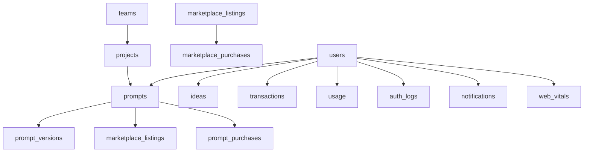

# 🗄️ **PromptForge.ai Database Documentation**

**Generated**: September 2, 2025  
**Database**: `promptforge` (MongoDB)  
**Total Collections**: 23  
**Total Documents**: 161  

---

## 📊 **Database Overview**

PromptForge.ai uses MongoDB with **23 collections** organized into functional domains:

### **📈 Collections by Activity Level**

| Collection | Documents | Purpose | Status |
|-----------|-----------|---------|--------|
| `auth_logs` | 95 | Authentication events | 🟢 Active |
| `usage` | 16 | Usage tracking | 🟢 Active |
| `ideas` | 15 | AI-generated ideas | 🟢 Active |
| `prompts` | 9 | Core prompt storage | 🟢 Active |
| `prompt_versions` | 9 | Prompt version control | 🟢 Active |
| `transactions` | 5 | Financial transactions | 🟢 Active |
| `users` | 5 | User accounts | 🟢 Active |
| `notifications` | 4 | User notifications | 🟢 Active |
| `web_vitals` | 3 | Performance metrics | 🟢 Active |
| **15 Empty Collections** | 0 | Various features | ⭐ Ready for scaling |

---

## 🔑 **Core Collections Detail**

### **1. 👤 Users Collection**
**Purpose**: Central user account management  
**Documents**: 5 active users  
**Indexes**: 6 optimized indexes  

#### **Schema Structure**:
```javascript
{
  "_id": "user-unique-id",
  "account_status": "active",
  "billing": {
    "provider": null,
    "customer_id": null,
    "plan": "free|pro|enterprise",
    "status": "active",
    "started_at": Date,
    "renewed_at": Date,
    "created_at": Date
  },
  "credits": {
    "balance": Number,
    "total_purchased": Number,
    "total_spent": Number,
    "last_purchase_at": Date,
    "starter_grant_used": Boolean
  },
  "display_name": String,
  "email": String,
  "email_verified": Boolean,
  "last_active_at": Date,
  "last_login_at": Date,
  "login_seq": Number,
  "partnership": {
    "is_partner": Boolean,
    "partner_tier": String,
    "application_status": "none|pending|approved"
  },
  "photo_url": String,
  "preferences": {
    "theme": "system|light|dark",
    "language": "en|es|fr...",
    "timezone": String,
    "notifications": {
      "marketing": Boolean,
      "product": Boolean,
      "security": Boolean
    },
    "privacy": {
      "discoverable": Boolean,
      "show_profile": Boolean
    },
    "interface": {
      "density": "comfortable|compact"
    }
  },
  "profile": {
    "bio": String,
    "website": String,
    "location": String,
    "company": String,
    "job_title": String,
    "expertise": String,
    "social_links": Object,
    "country": String
  },
  "security": {
    "two_factor_enabled": Boolean,
    "last_password_change": Date,
    "suspicious_activity_detected": Boolean,
    "gdpr_consent": Boolean,
    "gdpr_consent_date": Date,
    "data_retention_until": Date
  },
  "stats": {
    "prompts_created": Number,
    "ideas_generated": Number,
    "tests_run": Number,
    "marketplace_sales": Number,
    "total_earnings": Number,
    "average_rating": Number,
    "total_reviews": Number,
    "followers_count": Number,
    "following_count": Number
  },
  "subscription": {
    "tier": "free|pro|enterprise",
    "status": "active|inactive|cancelled",
    "stripe_customer_id": String,
    "provider_customer_id": String
  },
  "updated_at": Date,
  "version": Number,
  "login_seq": Number
}
```

#### **Key Indexes**:
- `user_id_1` - Primary lookup
- `email_1` - Login/authentication
- `account_status_1` - Active user filtering
- `subscription.tier_1` - Plan-based queries
- `last_active_at_-1` - Recent activity sorting
- `created_at_-1` - Registration date sorting

---

### **2. 📝 Prompts Collection**
**Purpose**: Core prompt storage and management  
**Documents**: 9 prompts  
**Indexes**: 8 performance indexes  

#### **Schema Structure**:
```javascript
{
  "_id": ObjectId,
  "user_id": String,
  "project_id": String,
  "title": String,
  "content": String,
  "category": String,
  "tags": [String],
  "visibility": "private|public|team",
  "status": "draft|active|archived",
  "deleted": Boolean,
  "metadata": {
    "version": Number,
    "word_count": Number,
    "token_estimate": Number,
    "complexity_score": Number
  },
  "performance": {
    "usage_count": Number,
    "success_rate": Number,
    "avg_rating": Number,
    "last_used": Date
  },
  "created_at": Date,
  "updated_at": Date
}
```

#### **Key Indexes**:
- `user_id_1_project_id_1` - User's project prompts
- `user_id_1_updated_at_-1` - Recent prompts
- `visibility_1_deleted_1_tags_1` - Public prompt discovery
- `tags_1` - Tag-based search
- `category_1_status_1` - Category filtering

---

### **3. 🔄 Prompt Versions Collection**
**Purpose**: Version control for prompts  
**Documents**: 9 versions  
**Indexes**: 4 indexes  

#### **Schema Structure**:
```javascript
{
  "_id": ObjectId,
  "prompt_id": String,
  "version_number": Number,
  "content": String,
  "changes": {
    "type": "major|minor|patch",
    "description": String,
    "diff": Object
  },
  "created_by": String,
  "created_at": Date,
  "is_current": Boolean
}
```

---

### **4. 💡 Ideas Collection**
**Purpose**: AI-generated ideas and suggestions  
**Documents**: 15 ideas  
**Indexes**: 2 indexes  

#### **Schema Structure**:
```javascript
{
  "_id": ObjectId,
  "user_id": String,
  "prompt_context": String,
  "generated_ideas": [String],
  "category": String,
  "quality_score": Number,
  "used": Boolean,
  "feedback": {
    "rating": Number,
    "comment": String
  },
  "created_at": Date
}
```

---

### **5. 💳 Transactions Collection**
**Purpose**: Financial transaction tracking  
**Documents**: 5 transactions  
**Indexes**: 4 indexes  

#### **Schema Structure**:
```javascript
{
  "_id": ObjectId,
  "user_id": String,
  "type": "purchase|refund|credit|debit",
  "amount": Number,
  "currency": "USD",
  "credits_affected": Number,
  "stripe_payment_intent": String,
  "status": "pending|completed|failed",
  "description": String,
  "metadata": Object,
  "created_at": Date,
  "completed_at": Date
}
```

---

### **6. 📊 Usage Collection**
**Purpose**: User activity and feature usage tracking  
**Documents**: 16 usage records  
**Indexes**: 2 indexes  

#### **Schema Structure**:
```javascript
{
  "_id": ObjectId,
  "user_id": String,
  "event_type": String,
  "feature": String,
  "metadata": Object,
  "session_id": String,
  "ip_address": String,
  "user_agent": String,
  "timestamp": Date
}
```

---

### **7. 🔐 Auth Logs Collection**
**Purpose**: Authentication and security event logging  
**Documents**: 95 auth events  
**Indexes**: 1 index  

#### **Schema Structure**:
```javascript
{
  "_id": ObjectId,
  "user_id": String,
  "event_type": "login|logout|failed_login|password_reset",
  "ip_address": String,
  "user_agent": String,
  "location": Object,
  "success": Boolean,
  "error_reason": String,
  "timestamp": Date
}
```

---

### **8. 🔔 Notifications Collection**
**Purpose**: User notification management  
**Documents**: 4 notifications  
**Indexes**: 3 indexes  

#### **Schema Structure**:
```javascript
{
  "_id": ObjectId,
  "user_id": String,
  "type": "system|billing|marketing|security",
  "title": String,
  "message": String,
  "read": Boolean,
  "read_at": Date,
  "action_url": String,
  "priority": "low|medium|high",
  "created_at": Date
}
```

---

### **9. 📈 Web Vitals Collection**
**Purpose**: Performance monitoring and optimization  
**Documents**: 3 performance records  
**Indexes**: 1 index  

#### **Schema Structure**:
```javascript
{
  "_id": ObjectId,
  "user_id": String,
  "page": String,
  "metrics": {
    "lcp": Number,  // Largest Contentful Paint
    "fid": Number,  // First Input Delay
    "cls": Number   // Cumulative Layout Shift
  },
  "browser": String,
  "device_type": String,
  "timestamp": Date
}
```

---

## 🏗️ **Empty Collections (Ready for Scaling)**

### **Marketplace & Commerce**
- `marketplace_listings` (11 indexes) - Product listings
- `marketplace_purchases` (3 indexes) - Purchase records
- `prompt_purchases` (3 indexes) - Prompt-specific purchases
- `listings` (2 indexes) - General listings

### **Analytics & Reporting**
- `analytics` (3 indexes) - Analytics data
- `analytics_events` (4 indexes) - Event tracking
- `analytics_jobs` (4 indexes) - Background processing

### **Team & Collaboration**
- `teams` (4 indexes) - Team management
- `projects` (4 indexes) - Project organization
- `reviews` (5 indexes) - User reviews

### **System Operations**
- `webhook_events` (2 indexes) - External integrations
- `export_jobs` (3 indexes) - Data export processing
- `exports` (2 indexes) - Export records
- `demo_bookings` (3 indexes) - Demo scheduling

---

## 🔗 **Data Relationships**

### **Primary Relationships**:


### **Key Foreign Keys**:
- `user_id` - Links all user-related data
- `prompt_id` - Links prompt-related data
- `project_id` - Groups prompts by project
- `team_id` - Team membership and access

---

## ⚡ **Performance Optimizations**

### **Index Strategy**:
1. **Primary Lookups**: All collections have user_id indexes
2. **Temporal Queries**: Created_at and updated_at indexes
3. **Status Filtering**: Status and deleted field indexes
4. **Search Operations**: Tag and category indexes
5. **Unique Constraints**: Email, job_id, and other unique fields

### **Query Patterns**:
- **User Dashboard**: `user_id + updated_at DESC`
- **Prompt Discovery**: `visibility + tags + category`
- **Analytics**: `user_id + timestamp range`
- **Security**: `user_id + event_type + timestamp`

---

## 🚀 **API Integration Points**

### **Endpoint → Collection Mapping**:

| API Endpoint Category | Primary Collections | Secondary Collections |
|----------------------|--------------------|--------------------|
| `/api/v1/users/*` | `users` | `auth_logs`, `usage` |
| `/api/v1/prompts/*` | `prompts` | `prompt_versions`, `ideas` |
| `/api/v1/marketplace/*` | `marketplace_listings` | `marketplace_purchases` |
| `/api/v1/analytics/*` | `analytics_events` | `usage`, `web_vitals` |
| `/api/v1/billing/*` | `transactions` | `users.billing` |
| `/api/v1/notifications/*` | `notifications` | `users.preferences` |

---

## 🔒 **Security & Compliance**

### **Data Protection**:
- **PII Fields**: Encrypted at application level
- **GDPR Compliance**: `security.gdpr_consent` tracking
- **Data Retention**: `security.data_retention_until` field
- **Access Logging**: Complete audit trail in `auth_logs`

### **Authentication Model**:
- **Firebase Integration**: External auth provider
- **Session Tracking**: `login_seq` for session management
- **Security Events**: Real-time monitoring in `auth_logs`

---

## 📋 **Collection Readiness Status**

### **🟢 Production Ready** (9 collections):
- `users`, `prompts`, `prompt_versions`, `ideas`
- `transactions`, `usage`, `auth_logs`, `notifications`, `web_vitals`

### **⭐ Prepared for Scale** (14 collections):
- All marketplace, analytics, and team collaboration collections
- Pre-indexed and ready for immediate data ingestion
- Schema-ready for business expansion

---

## 🔧 **Development Recommendations**

### **Immediate Priorities**:
1. **Marketplace Launch**: Activate `marketplace_listings` collection
2. **Team Features**: Implement `teams` and `projects` functionality
3. **Analytics Pipeline**: Begin populating `analytics_events`
4. **Export System**: Activate `export_jobs` for data portability

### **Performance Monitoring**:
1. Monitor `auth_logs` growth (95 documents and growing)
2. Optimize `usage` collection queries (16 documents)
3. Implement `web_vitals` collection aggregation pipeline

### **Business Intelligence**:
1. Connect `transactions` to billing analytics
2. Implement `ideas` quality scoring
3. Build `prompt_versions` diff visualization
4. Create `notifications` delivery analytics

---

**Last Updated**: September 2, 2025  
**Generated By**: MongoDB Database Analyzer  
**Schema Version**: Current Production Schema  

---

*This documentation is automatically generated from live database analysis. Update this document when schema changes are deployed.*
